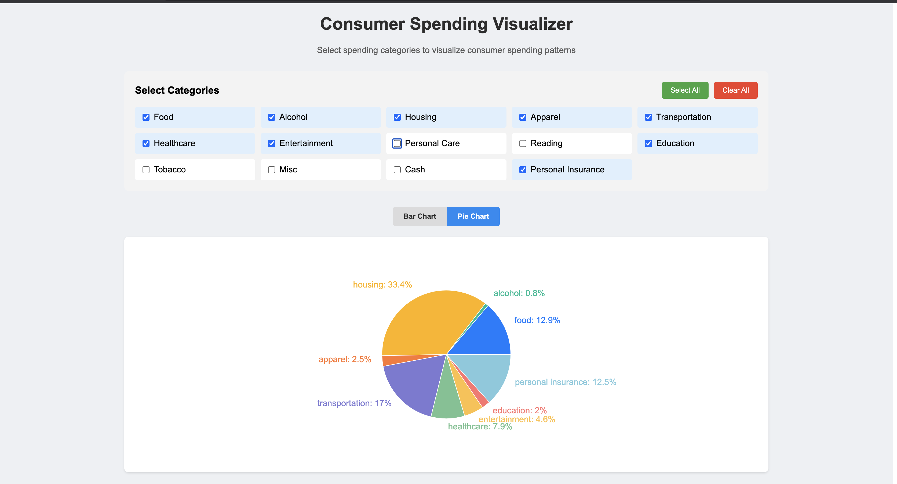

# Consumer Spending Visualizer

An interactive React application for visualizing consumer spending patterns across different categories.


## Features

- Interactive category selection with checkboxes
- Dynamic bar chart and pie chart visualizations
- Real-time data updates as you select categories
- Detailed spending summary table
- Shows both dollar amounts and percentages
- Clean, modern UI with responsive design

## Installation

1. Install dependencies:
```bash
npm install
```

2. Start the development server:
```bash
npm run dev
```

3. Open your browser to `http://localhost:3000`

## Usage

1. **Select Categories**: Click on the checkboxes to select spending categories you want to visualize
2. **View Charts**: Toggle between bar chart and pie chart views
3. **Review Summary**: Scroll down to see a detailed table with amounts and percentages
4. **Quick Actions**: Use "Select All" or "Clear All" buttons for convenience

## Spending Categories

The app includes 14 consumer spending categories:
- Food
- Alcohol
- Housing
- Apparel
- Transportation
- Healthcare
- Entertainment
- Personal Care
- Reading
- Education
- Tobacco
- Miscellaneous
- Cash Contributions
- Personal Insurance

## Technology Stack

- **React** - UI framework
- **Recharts** - Chart library for visualizations
- **Vite** - Build tool and dev server

## Build for Production

```bash
npm run build
```

The built files will be in the `dist` directory.

## Data Source

Consumer spending data represents average annual household expenditures based on typical spending patterns.
https://www.bls.gov/news.release/cesan.nr0.htm
